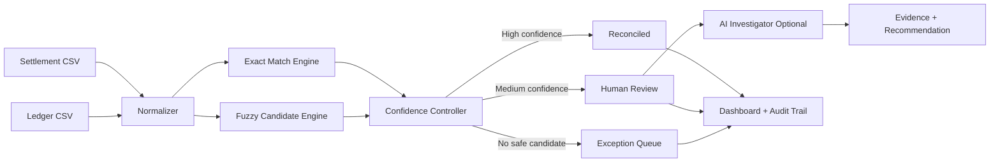

# FinClose AI Architecture

## Design decision
The AI component is deliberately constrained. Financial correctness comes from transaction evidence and deterministic controls. AI is used to explain and investigate ambiguity, not to invent matches.
